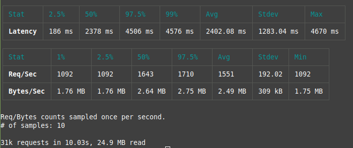

## Nginx BusyBox Apache Comperator

10 years ago I switched apache to nginx, and want to check how are they doing in the docker setup.

Task is to test them


1) for static file serving

    - same files frequently
    - small files (like thumbnails, svg collection upto 10k)
    - normal sized files ( on avarage 1Mb )
    - partial file download ( more then 50Mb )

2) proxy efficiency

    - performance
    - caching perfmance

3) Bonus needs

    - documentation clearity
    - docker image documentation
    - size on disk
    - memory consumption

* Notes:


  I've used normal nginx image since it's recommended in the docs,

  Test can be faulty since docker-proxy gets saturated ( 100% cpu )

  I want to experiment memory server ( will store /dist folder in memory)


### Why havent X been tested?
  Please open an issue. We will, or better we can pull pr.

## Static file serving

### Apache
  

### Nginx
  

### BusyBox
  

  Yes busybox has httpd server! Its super fast to install as docker image because its 2MB,


### Docker Image sizes

```
nginx                             latest         593aee2afb64   2 days ago      187MB
httpd                             latest         75a48b16cd56   7 days ago      168MB
busybox                           latest         a416a98b71e2   3 months ago    4.26MB

```
